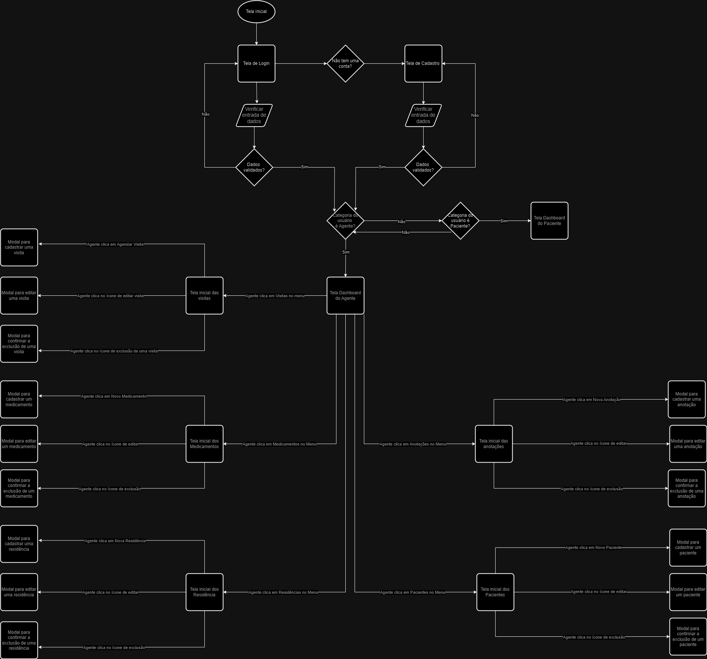

# Projeto de Interface

Elaboramos a visão geral da interação do usuário pelas telas do sistema e protótipo interativo das telas com as funcionalidades que fazem parte do sistema (wireframes). Além disso, apresentamos as principais interfaces da plataforma. Discutimos como ela foi elaborada de forma a atender os requisitos funcionais, não funcionais e histórias de usuário abordados nas <a href="2-Especificação do Projeto.md"> Documentação de Especificação</a>.

## Diagrama de Fluxo

O diagrama apresenta o estudo do fluxo de interação do usuário com o sistema interativo e  muitas vezes sem a necessidade do desenho do design das telas da interface. Isso permite que o design das interações seja bem planejado e gere impacto na qualidade no design do wireframe interativo que será desenvolvido logo em seguida.

[Prototype](https://www.figma.com/proto/lw75jaRKnAiAaMj0cBSvbD/Wireframes?type=design&node-id=296-1607&t=cPgoTVse0bBHwFXL-1&scaling=min-zoom&page-id=119%3A787&starting-point-node-id=296%3A1607&show-proto-sidebar=1&mode=design)

## Wireframes - Web

O wireframe para a aplicação web tem como objetivo facilitar o processo de codificação. Funcionando como a estrutura visual da aplicação, o protótipo esboça o design e as funcionalidades das páginas principais. Segue abaixo as **principais telas** do Wireframe da Aplicação Front-End Web:

**Tela Landing Page**

Essa tela possui uma série de serviços disponíveis pelo site que são visualizados por transição e onde o Usuário pode clicar para acessar aquela determinada opção.
 

**Tela Login**

Também na Landing Page, o usuário que já tiver cadastro, tem a opção de efetuar o Login. Ao clicar no botão “Entrar” ocorre o redirecionamento para a pagina de Login para que o usuário insira seu e-mail e sua senha acessando assim, suas informações.

**Tela Cadastro**

No cabeçalho da Landing Page o usuário terá a opção de efetuar o Cadastro para começar a utilizar os serviços disponibilizados pela aplicação. Ao clicar no botão “Cadastrar” é redirecionado para a página de cadastro para que ele adicione suas informações.

**Tela Inicial**

Após fazer o cadastro/login no site o Usuário é redirecionado a Tela Inicial onde agora ela é personalizada no canto superior direito com seu Nome e a opção de sair. Ao centro, podemos visualizar os dashboards, uma visão geral de informações super essenciais para o agente.

**Menu**

Ao lado esquerdo é posssivel visualizar o Menu, que tem como função ser usado para navegar entre as páginas.

**Tela Pacientes**

Clicando em Pacientes no Menu a esquerda, o agente encontra uma tela na qual pode cadastrar pacientes, adicionando dados que irão ser usados de forma eficiente posteriomente.

**Tela Medicamentos**

Clicando em Medicamentos no Menu a esquerdo, o usuário cai na tela de medicamentos, tela essa que o agente poderá criar o conjunto de medicações que o paciente irá tomar durante determinado periodo.

**Tela Medicações**

Clicando em Medicações no Menu a esquerda, iremos para a tela de medicações, na qual o agente adiciona os remêdios que o paciente posteriomente irá tomar, e que pode ser adicionado em medicamentos caso seja prescrito ao paciente tomar mais de um remêdio. 

**Tela Residência**

Clicando em Residências no Menu a esquerda, o agente consegue registrar as residências dos pacientes, para posteriomente visitá-los se necessario.

**Tela Visitas**

Clicando em Visitas no Menu a esquerda, o agente acrescenta dados que permitem marcar a visita com determinado paciente em determinada data. Além disso, é possivel acrescentar um status de acompanhamento dessas visitas e acrescentar observações também.

**Tela Anotações**

Clicando em Visitas no Menu a esquerda, o agente poderá relacionar uma anotação/lembrete a um determinado paciente e usar essa função para uma ação futura.

**Tela Bate-Papo**

Clicando em Bate-Papo no Menu a esquerda, o agente consegue dialogar com os pacientes.

**Modals**

Aqui está reunidos os modals de excluir e salvar.

-----------------

## Wireframes - Mobile

O wireframe para a aplicação mobile tem como objetivo facilitar o processo de codificação. Funcionando como a estrutura visual da aplicação, o protótipo esboça o design e as funcionalidades das páginas principais. Segue abaixo as **principais telas** do Wireframe da Aplicação Front-End Mobile:

**Tela Landing Page**

Essa tela possui uma série de serviços disponíveis pelo site que são visualizados por transição e onde o Usuário pode clicar para acessar aquela determinada opção.
 

**Tela Login**

Também na Landing Page, o usuário que já tiver cadastro, tem a opção de efetuar o Login. Ao clicar no botão “Entrar” ocorre o redirecionamento para a pagina de Login para que o usuário insira seu e-mail e sua senha acessando assim, suas informações.

**Tela Cadastro**

No cabeçalho da Landing Page o usuário terá a opção de efetuar o Cadastro para começar a utilizar os serviços disponibilizados pela aplicação. Ao clicar no botão “Cadastrar” é redirecionado para a página de cadastro para que ele adicione suas informações.

**Tela Inicial**

Após fazer o cadastro/login no site o Usuário é redirecionado a Tela Inicial onde agora ela é personalizada no canto superior direito com seu Nome e a opção de sair. Ao centro, podemos visualizar os dashboards, uma visão geral de informações super essenciais para o agente.

**Menu**

Ao lado esquerdo é posssivel visualizar o Menu, que tem como função ser usado para navegar entre as páginas.

**Tela Pacientes**

Clicando em Pacientes no Menu a esquerda, o agente encontra uma tela na qual pode cadastrar pacientes, adicionando dados que irão ser usados de forma eficiente posteriomente.

**Tela Medicamentos**

Clicando em Medicamentos no Menu a esquerdo, o usuário cai na tela de medicamentos, tela essa que o agente poderá criar o conjunto de medicações que o paciente irá tomar durante determinado periodo.

**Tela Medicações**

Clicando em Medicações no Menu a esquerda, iremos para a tela de medicações, na qual o agente adiciona os remêdios que o paciente posteriomente irá tomar, e que pode ser adicionado em medicamentos caso seja prescrito ao paciente tomar mais de um remêdio. 

**Tela Residência**

Clicando em Residências no Menu a esquerda, o agente consegue registrar as residências dos pacientes, para posteriomente visitá-los se necessario.

**Tela Visitas**

Clicando em Visitas no Menu a esquerda, o agente acrescenta dados que permitem marcar a visita com determinado paciente em determinada data. Além disso, é possivel acrescentar um status de acompanhamento dessas visitas e acrescentar observações também.

**Tela Anotações**

Clicando em Visitas no Menu a esquerda, o agente poderá relacionar uma anotação/lembrete a um determinado paciente e usar essa função para uma ação futura.

**Tela ChatBot**

Clicando em ChatBot no canto direito na Tela de Landing Page, o usuario consegue tirar dúvidas com o nosso chatbot.

> **📌 Acompanhe as demais telas do Wireframe Web e Mobile**:
> - [Wireframes](https://www.figma.com/file/lw75jaRKnAiAaMj0cBSvbD/Wireframes?type=design&node-id=0-1&mode=design&t=MkPiGwCNYA7lmvBo-0)

