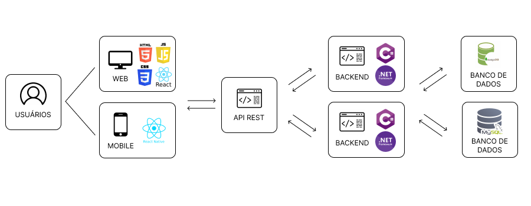

# Arquitetura da Solução

<span style="color:red">Pré-requisitos: <a href="3-Projeto de Interface.md"> Projeto de Interface</a></span>

Definição de como o software é estruturado em termos dos componentes que fazem parte da solução e do ambiente de hospedagem da aplicação.



## Diagrama de Classes

O diagrama de classes ilustra graficamente como será a estrutura do software, e como cada uma das classes da sua estrutura estarão interligadas. Essas classes servem de modelo para materializar os objetos que executarão na memória.


## Modelo ER

O Modelo ER representa através de um diagrama como as entidades (coisas, objetos) se relacionam entre si na aplicação interativa.

As referências abaixo irão auxiliá-lo na geração do artefato “Modelo ER”.

> - [Como fazer um diagrama entidade relacionamento | Lucidchart](https://www.lucidchart.com/pages/pt/como-fazer-um-diagrama-entidade-relacionamento)

## Esquema Relacional

O Esquema Relacional corresponde à representação dos dados em tabelas juntamente com as restrições de integridade e chave primária.
 
 
<<<<<<< HEAD

## Modelo JSON

- [Anotações](../api-web-services-dose-certa/api-web-services-dose-certa/Models/Note.cs):
```
{
  "$schema": "http://json-schema.org/draft-07/schema#",
  "title": "Note",
  "description": "Este documento registra os detalhes de uma anotação",
  "type": "object",
  "properties": {
    "_id": {
      "type": "string",
      "format": "uuid",
      "description": "Identificador único da anotação"
    },
    "Content": {
      "type": "string",
      "description": "O conteúdo da anotação"
    },
    "CreationDate": {
      "type": "string",
      "format": "date-time",
      "description": "A data e hora em que a anotação foi criada"
    },
    "IdUserAgente": {
      "type": "string",
      "format": "uuid",
      "description": "Referência para usuário Agente"
    },
    "IdUserPaciente": {
      "type": "string",
      "format": "uuid",
      "description": "Referência para usuário Paciente"
    }
  },
  "required": ["_id", "Content", "CreationDate", "IdUserAgente", "IdUserPaciente"]
}
```
- [Remédio](../api-web-services-dose-certa/api-web-services-dose-certa/Models/):
```
{
  "$schema": "http://json-schema.org/draft-07/schema#",
  "title": "Remedio",
  "description": "Este documento registra os detalhes de um remédio",
  "type": "object",
  "properties": {
    "_id": {
      "type": "string",
      "format": "uuid",
      "description": "Identificador único do remédio"
    },
    "Nome": {
      "type": "string",
      "description": "O nome do remédio"
    },
    "Dosagem": {
      "type": "string",
      "description": "A dosagem do remédio"
    },
    "Horario": {
      "type": "string",
      "format": "date-time",
      "description": "Horário de tomar o remédio"
    },
    "Indicações": {
      "type": "string",
      "description": "Indicações do remédio"
    },
    "Frequência": {
      "type": "string",
      "description": "Frequência de uso do remédio"
    }
  },
  "required": ["_id", "Nome", "Dosagem", "Horario", "Indicações", "Frequência"]
}
```
- [Medicação](../api-web-services-dose-certa/api-web-services-dose-certa/Models/):
```
{
  "$schema": "http://json-schema.org/draft-07/schema#",
  "title": "Medicacao",
  "description": "Este documento registra os detalhes de uma medicação",
  "type": "object",
  "properties": {
    "_id": {
      "type": "string",
      "format": "uuid",
      "description": "Identificador único da medicação"
    },
    "IdUsuario": {
      "type": "string",
      "format": "uuid",
      "description": "Referência ao usuário"
    },
    "Remedios": {
      "type": "array",
      "description": "Lista de IDs de medicamentos",
      "items": {
        "type": "string",
        "format": "uuid"
      }
    },
    "DataInicio": {
      "type": "string",
      "format": "date-time",
      "description": "Data de início da medicação"
    },
    "DataTermino": {
      "type": "string",
      "format": "date-time",
      "description": "Data de término da medicação"
    },
    "Observacoes": {
      "type": "string",
      "description": "Observações sobre a medicação"
    }
  },
  "required": ["_id", "IdUsuario", "Remedios", "DataInicio", "DataTermino"]
}
```
- [Visita](../api-web-services-dose-certa/api-web-services-dose-certa/Models/):
```
{
  "$schema": "http://json-schema.org/draft-07/schema#",
  "title": "Visita",
  "description": "Este documento registra os detalhes de uma visita",
  "type": "object",
  "properties": {
    "_id": {
      "type": "string",
      "format": "uuid",
      "description": "Identificador único da visita"
    },
    "DataVisita": {
      "type": "string",
      "format": "date-time",
      "description": "Data da visita"
    },
    "Status": {
      "type": "string",
      "enum": ["Fazer", "Concluída", "Em Andamento"],
      "description": "Status da visita"
    },
    "Observacoes": {
      "type": "string",
      "description": "Observações sobre a visita"
    },
    "IdPaciente": {
      "type": "string",
      "format": "uuid",
      "description": "Referência ao paciente"
    },
    "IdUsuario": {
      "type": "string",
      "format": "uuid",
      "description": "Referência ao usuário que realizou a visita"
    }
  },
  "required": ["_id", "DataVisita", "Status", "IdPaciente", "IdUsuario"]
}
```


=======

## Modelo JSON
>>>>>>> origin/main

- [Anotações](../api-web-services-dose-certa/api-web-services-dose-certa/Models/Note.cs):
```
{
  "$schema": "http://json-schema.org/draft-07/schema#",
  "title": "Note",
  "description": "Este documento registra os detalhes de uma anotação",
  "type": "object",
  "properties": {
    "_id": {
      "type": "string",
      "format": "uuid",
      "description": "Identificador único da anotação"
    },
    "Content": {
      "type": "string",
      "description": "O conteúdo da anotação"
    },
    "CreationDate": {
      "type": "string",
      "format": "date-time",
      "description": "A data e hora em que a anotação foi criada"
    },
    "IdUserAgente": {
      "type": "string",
      "format": "uuid",
      "description": "Referência para usuário Agente"
    },
    "IdUserPaciente": {
      "type": "string",
      "format": "uuid",
      "description": "Referência para usuário Paciente"
    }
  },
  "required": ["_id", "Content", "CreationDate", "IdUserAgente", "IdUserPaciente"]
}
```
- [Remédio](../api-web-services-dose-certa/api-web-services-dose-certa/Models/Remedio.cs):
```
{
  "$schema": "http://json-schema.org/draft-07/schema#",
  "title": "Remedio",
  "description": "Este documento registra os detalhes de um remédio",
  "type": "object",
  "properties": {
    "_id": {
      "type": "string",
      "format": "uuid",
      "description": "Identificador único do remédio"
    },
    "Nome": {
      "type": "string",
      "description": "O nome do remédio"
    },
    "Dosagem": {
      "type": "string",
      "description": "A dosagem do remédio"
    },
    "Horario": {
      "type": "string",
      "format": "date-time",
      "description": "Horário de tomar o remédio"
    },
    "Indicações": {
      "type": "string",
      "description": "Indicações do remédio"
    },
    "Frequência": {
      "type": "string",
      "description": "Frequência de uso do remédio"
    }
  },
  "required": ["_id", "Nome", "Dosagem", "Horario", "Indicações", "Frequência"]
}
```
- [Medicação](../api-web-services-dose-certa/api-web-services-dose-certa/Models/Medicacao.cs):
```
{
  "$schema": "http://json-schema.org/draft-07/schema#",
  "title": "Medicacao",
  "description": "Este documento registra os detalhes de uma medicação",
  "type": "object",
  "properties": {
    "_id": {
      "type": "string",
      "format": "uuid",
      "description": "Identificador único da medicação"
    },
    "IdUsuario": {
      "type": "string",
      "format": "uuid",
      "description": "Referência ao usuário"
    },
    "Remedios": {
      "type": "array",
      "description": "Lista de IDs de medicamentos",
      "items": {
        "type": "string",
        "format": "uuid"
      }
    },
    "DataInicio": {
      "type": "string",
      "format": "date-time",
      "description": "Data de início da medicação"
    },
    "DataTermino": {
      "type": "string",
      "format": "date-time",
      "description": "Data de término da medicação"
    },
    "Observacoes": {
      "type": "string",
      "description": "Observações sobre a medicação"
    }
  },
  "required": ["_id", "IdUsuario", "Remedios", "DataInicio", "DataTermino"]
}
```
- [Visita](../api-web-services-dose-certa/api-web-services-dose-certa/Models/Visita.cs):
```
{
  "$schema": "http://json-schema.org/draft-07/schema#",
  "title": "Visita",
  "description": "Este documento registra os detalhes de uma visita",
  "type": "object",
  "properties": {
    "_id": {
      "type": "string",
      "format": "uuid",
      "description": "Identificador único da visita"
    },
    "DataVisita": {
      "type": "string",
      "format": "date-time",
      "description": "Data da visita"
    },
    "Status": {
      "type": "string",
      "enum": ["Fazer", "Concluída", "Em Andamento"],
      "description": "Status da visita"
    },
    "Observacoes": {
      "type": "string",
      "description": "Observações sobre a visita"
    },
    "IdPaciente": {
      "type": "string",
      "format": "uuid",
      "description": "Referência ao paciente"
    },
    "IdUsuario": {
      "type": "string",
      "format": "uuid",
      "description": "Referência ao usuário que realizou a visita"
    }
  },
  "required": ["_id", "DataVisita", "Status", "IdPaciente", "IdUsuario"]
}
```
- [Residência]():
```
{
  "$schema": "http://json-schema.org/draft-07/schema#",
  "title": "Residencia",
  "description": "Este documento registra os detalhes de uma residência",
  "type": "object",
  "properties": {
    "Id": {
      "type": ["string", "null"],
      "format": "uuid",
      "description": "Identificador único da residência"
    },
    "Rua": {
      "type": "string",
      "description": "Nome da rua onde a residência está localizada"
    },
    "Numero": {
      "type": "string",
      "description": "Número da residência"
    },
    "Complemento": {
      "type": ["string", "null"],
      "description": "Complemento do endereço da residência"
    },
    "Cidade": {
      "type": "string",
      "description": "Cidade onde a residência está localizada"
    },
    "Bairro": {
      "type": "string",
      "description": "Bairro onde a residência está localizada"
    },
    "IdUsuarioAgente": {
      "type": ["integer", "null"],
      "description": "Identificador do usuário agente associado à residência"
    }
  },
  "required": ["Rua", "Numero", "Cidade", "Bairro"]
}
```
- [Notificações]():
```
{
  "$schema": "http://json-schema.org/draft-07/schema#",
  "title": "Notifications",
  "description": "Este documento registra os detalhes de uma notificação",
  "type": "object",
  "properties": {
    "Id": {
      "type": ["string", "null"],
      "format": "uuid",
      "description": "Identificador único da notificação"
    },
    "Message": {
      "type": ["string", "null"],
      "description": "Mensagem da notificação"
    },
    "DateSent": {
      "type": "string",
      "format": "date-time",
      "description": "Data e hora em que a notificação foi enviada"
    },
    "Read": {
      "type": "boolean",
      "description": "Indica se a notificação foi lida"
    },
    "RecipientUserId": {
      "type": ["string", "null"],
      "format": "uuid",
      "description": "Identificador do usuário destinatário da notificação"
    }
  },
  "required": ["DateSent", "Read"]
}
```
## Modelo Físico

Arquivo dosecerta.sql contendo os scripts de criação das tabelas do banco de dados. Este arquivo deverá ser incluído dentro da pasta src\bd.

[Clique aqui para acessar o dosecerta.sql](../src/db)

## Tecnologias Utilizadas

Todas as tecnologias envolvidas, linguagens a serem utilizadas, serviços web, frameworks, bibliotecas, IDEs de desenvolvimento, e ferramentas.

| Categoria | Tecnologia | Descrição |
| --- |---|---|
| Linguagem utilizada | Javascript | Adiciona interatividade e dinamismo a uma página web |
| | C# | Linguagem de programação robusta e versátil usada para desenvolvimento web back-end. |
| | HTML | Define a estrutura e o conteúdo de uma página web. |
| | CSS | Define o estilo visual de uma página web. |
| Frameworks | ASP.NET | Criar APIs e aplicações web robustas. |
| | React | Framework para construir interfaces de usuário interativas com JavaScript. |
| | React Native | Framework para construir interfaces de usuário interativas para aplicações mobile com JavaScript. |
| Bibliotecas | Bootstrap | Cria layouts responsivos e componentes de interface de usuário. |
| IDEs de Desenvolvimento | Visual Studio Code | Editor de código leve e poderoso com muitos recursos para desenvolvimento web. |
| Ferramentas | Git | Sistema de controle de versão para gerenciar o código do seu projeto. |
| | GitHub | Plataforma online para hospedar e gerenciar projetos Git. |
| Banco de dados | MongoDB | Banco de dados NoSQL de código aberto, popular por sua alta performance, escalabilidade e flexibilidade. |

## Hospedagem

- Front-end web: 
- Front-end mobile: 
- Back-end: 
- Bancos de dados: 

## Qualidade de Software

A qualidade do software é a medida em que um software atende às necessidades do usuário e aos padrões de qualidade estabelecidos. Isso inclui a capacidade do software de funcionar corretamente, ser fácil de usar e ser seguro e confiável. A qualidade do software também pode ser medida pela eficiência e eficácia do software, como o seu desempenho, por exemplo.

Portanto, o aplicativo “Dose Certa” estar passando por um rigoroso processo de controle de qualidade. Sendoi desenvolvido para ajudar os usuários a gerenciar seus medicamentos, bem como fornecer lembretes para tomar os medicamentos no horário correto. O aplicativo possui uma interface intuitiva e fácil de usar, tornando-o acessível para usuários de todos os níveis de habilidade. Além disso, é uma aplicação de alta segurança e desempenho, voltada para o uso pessoal. Ele terá uma escala de dosagem e opção de exportar as informações sempre que quiser.
De acordo com a NBR ISO/IEC 9126, realizamos o processo de controle de qualidade do projeto “Dose Certa” a partir das seguintes características e subcaracterísticas. 

Funcionalidade: Ajuda os usuários a gerenciar seus medicamentos diários. Inclui a dosagem diária e oferece recursos para exportar e filtrar.

- Adequação: Presença de conjunto de funções e sua adequação para tarefas.
- Acurácia: Produção de resultados ou efeitos corretos; 
- Conformidade: Estar em conformidade com normas, convenções e regulamentações.

Confiabilidade: É seguro e confiável. Possui autenticação (Login/Cadastro) de usuários. Garante a proteção das informações pessoais dos usuários. 

- Segurança de Acesso: Capacidade de evitar acesso não autorizado a programas e dados; 
- Maturidade: Indicação de baixa frequência de falhas;
- Tolerância a falhas: Manter nível de desempenho em caso de falha; 
- Recuperabilidade: Capacidade de se restabelecer e restaurar dados após falha. 

Portabilidade: Disponível como aplicação web e mobile. Oferece suporte a diferentes sistemas operacionais.

- Adaptabilidade: Capacidade de ser adaptado a ambientes diferentes; 
- Capacidade para ser testado: Medida do esforço necessário para se instalar o produto; 
- Conformidade: Medida do nível de conformidade do produto com padrões referentes à portabilidade; 
- Capacidade para substituir: Medida de esforço necessário para usar o produto em substituição a outro, previamente especificado. 

Manutenibilidade: Possui atualizações regulares para melhorias e correções; oferece suporte técnico aos usuários; mantém um registro de erros e bugs para solucioná-los de forma eficaz.

- Analisabilidade: Facilidade de diagnosticar deficiências e causas de falhas; 
- Modificabilidade: Facilidade de modificação e remoção de defeitos; 
- Estabilidade: Ausência de riscos de efeitos inesperados; 
- Testabilidade: Facilidade de ser testado. 

Eficiência: Tempo de resposta satisfatório e requisitos de hardware baixos provando ser uma aplicação funcional para todos os tipos de aparelhos e usuários.
 
- Comportamento em relação ao tempo: tempo de resposta, de processamento;
- Comportamento em relação a recursos: medida da quantidade de recursos necessários (CPU, disco e memória, entre outros) e a duração;

Em resumo, o “Dose Certa” é um exemplo de software de qualidade, que tem como objetivo atrair e treinar agentes comunitários para auxiliar idosos que não sabem ler e escrever. Com uma interface amigável, intuitivos e recursos de segurança avançados, “Dose Certa” é a escolha perfeita para quem deseja simplificar o processo de organização de medicamentos com eficiência e confiabilidade.
