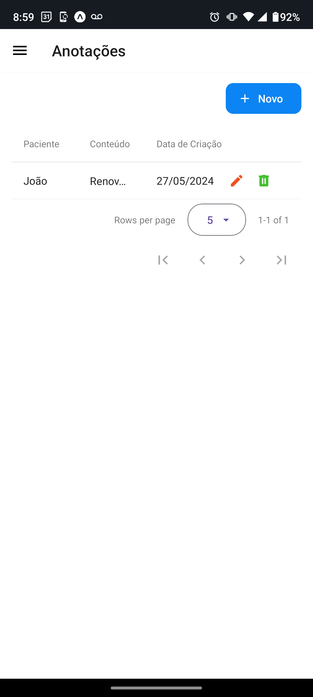

# Programação de Funcionalidades

Implementação do sistema descritas por meio dos requisitos funcionais e/ou não funcionais. Deve relacionar os requisitos atendidos os artefatos criados (código fonte) além das estruturas de dados utilizadas e as instruções para acesso e verificação da implementação que deve estar funcional no ambiente de hospedagem.

Para cada requisito funcional, pode ser entregue um artefato desse tipo:

### Funcionalidade 06: Cadastro de Visitas (RF-006)
A funcionalidade de Cadastro de Visitas (RF-006) permite que um agente comunitário cadastrado na plataforma `Dose Certa` agende visitas domiciliares para os pacientes. Ao fornecer detalhes como data, obs, status, e o paciente a ser visitado, o agente poderá posteriormente realizar outras atividades disponíveis na plataforma, tendo essas informações como base.

|ID    | Descrição do Requisito  | Artefato(s) produzido(s) |
|------|-----------------------------------------|----|
|RF-006| O sistema deve permitir que os agentes comunitários agendem visitas domiciliares com os pacientes. | AppMenu.tsx / visita(page.tsx) / VisitaController / Visita.cs(Models) / VisitaService.cs / visitastsx |

|  |  |  |
|:---:|:---:|:---:|

##### Instruções de uso/acesso
1. Acesse o site pelo [Link](https://github.com/ICEI-PUC-Minas-PMV-ADS/Dose-Certa?tab=readme-ov-file)
2. Certifique que o seu cadastro/login foi efetuado corretamente
3. No Menu clique em Visitas
4. Clique em + Novo
5. Selecione um Paciente, data, status e adicione uma observação
6. Clique no botão Salvar
7. Clique no icone Lápis para Editar
8. Clique no icone Lixeira para Apagar

##### Artefatos produzidos
* [AppMenu.tsx](api-web-frontend-dose-certa/layout/AppMenu.tsx)
* [visita(page.tsx)](api-web-frontend-dose-certa/app/(main)/pages/visita)
* [VisitaController](api-web-services-dose-certa/api-web-services-dose-certa/Controllers/VisitaController.cs)
* [Visita.cs(Models)](api-web-services-dose-certa/api-web-services-dose-certa/Models/Visita.cs)
* [VisitaService.cs](api-web-services-dose-certa/api-web-services-dose-certa/Services/VisitaService.cs)
* [visitas.tsx](../mobile-frontend-dose-certa/src/pages/visitas.tsx)

### Funcionalidade 08: Cadastrar Residências (RF-008)
A funcionalidade de Cadastro de Residência (RF-008) permite que um usuário cadastrado na plataforma `Dose Certa` insira informações sobre as residências dos pacientes. Ao fornecer detalhes como rua, número, cidade, bairro e complemento o usuário poderá posteriormente realizar outras atividades disponíveis na plataforma, tendo essas informações como base.

|ID    | Descrição do Requisito  | Artefato(s) produzido(s) |
|------|-----------------------------------------|----|
|RF-008| O sistema deve permitir o cadastro de informações sobre as residências dos pacientes. | AppMenu.tsx / residencia(page.tsx) / ResidenciaController / Residencia.cs(Models) / ResidenciaService.cs 

##### Instruções de uso/acesso
1. Acesse o site pelo [Link](https://github.com/ICEI-PUC-Minas-PMV-ADS/Dose-Certa?tab=readme-ov-file)
2. Certifique que o seu cadastro/login foi efetuado corretamente
3. No Menu clique em Residencias
4. Clique em + Novo
5. Cadastre em Residencias os dados rua, número, cidade, bairro e complemento
6. Clique no botão Salvar
7. Clique no icone Lápis para Editar
8. Clique no icone Lixeira para Apagar

##### Artefatos produzidos
* [AppMenu.tsx](api-web-frontend-dose-certa/layout/AppMenu.tsx)
* [residencia(page.tsx)](api-web-frontend-dose-certa/app/(main)/pages/residencia)
* [ResidenciaController](api-web-services-dose-certa/api-web-services-dose-certa/Controllers/ResidenciaController.cs)
* [Residencia.cs(Models)](api-web-services-dose-certa/api-web-services-dose-certa/Models/Residencia.cs)
* [ResidenciaService.cs](api-web-services-dose-certa/api-web-services-dose-certa/Services/ResidenciaService.cs)

### Funcionalidade 09: Criação de Anotações (RF-009)
A funcionalidade de Criação de Anotações/Lembretes (RF-009) permite que um usuário cadastrado na plataforma `Dose Certa` crie anotações ou lembretes relacionados a tarefas pendentes. Ao criar uma anotação/lembrete e atribuir a um paciente, o agente poderá posteriormente realizar outras atividades tendo essas informações como base.

|ID    | Descrição do Requisito  | Artefato(s) produzido(s) |
|------|-----------------------------------------|----|
|RF-009| O sistema deve permitir que os usuários (agentes e pacientes) possam criar anotações relacionadas a tarefas pendentes ou lembretes. | AppMenu.tsx / note(page.tsx) / NotesController / Note.cs(Models) / NotesService.cs / anotacoes.tsx |

|  |  |  |
|:---:|:---:|:---:|

##### Instruções de uso/acesso
1. Acesse o site pelo [Link](https://github.com/ICEI-PUC-Minas-PMV-ADS/Dose-Certa?tab=readme-ov-file)
2. Certifique que o seu cadastro/login foi efetuado corretamente
3. No Menu clique em Anotações
4. Clique em + Novo
5. Selecione o Paciente e adicione uma anotação
6. Clique no botão Salvar
7. Clique no icone Lápis para Editar
8. Clique no icone Lixeira para Apagar

##### Artefatos produzidos
* [AppMenu.tsx](api-web-frontend-dose-certa/layout/AppMenu.tsx)
* [note(page.tsx)](api-web-frontend-dose-certa/app/(main)/pages/note)
* [NotesController](api-web-services-dose-certa/api-web-services-dose-certa/Controllers/NotesController.cs)
* [Note.cs(Models)](api-web-services-dose-certa/api-web-services-dose-certa/Models/Note.cs)
* [NotesService.cs](api-web-services-dose-certa/api-web-services-dose-certa/Services/NotesService.cs)
* [anotacoes.tsx](../mobile-frontend-dose-certa/src/pages/anotacoes.tsx)

### Funcionalidade 11: Listagem de Visitas (RF-0011)
A funcionalidade de Listagem de Visitas (RF-0011) permite que um agente comunitário cadastrado na plataforma `Dose Certa` visualize uma lista das visitas agendadas para o dia. Ao acessar essa lista, o agente poderá se organizar e planejar suas atividades do dia com base nas informações disponíveis.

|ID    | Descrição do Requisito  | Artefato(s) produzido(s) |
|------|-----------------------------------------|----|
|RF-011| O sistema deve permitir que os agentes comunitários visualizem uma lista das visitas agendadas para o dia. | AppMenu.tsx / visita(page.tsx) / VisitaController / Visita.cs(Models) / VisitaService.cs

##### Instruções de uso/acesso
1. Acesse o site pelo [Link](https://github.com/ICEI-PUC-Minas-PMV-ADS/Dose-Certa?tab=readme-ov-file)
2. Certifique que o seu cadastro/login foi efetuado corretamente
3. No Menu clique em Visitas
4. Clique em + Novo
5. Selecione um Paciente, data, status e adicione uma observação
6. Clique no botão Salvar
7. Clique no icone Lápis para Editar
8. Clique no icone Lixeira para Apagar

##### Artefatos produzidos
* [AppMenu.tsx](api-web-frontend-dose-certa/layout/AppMenu.tsx)
* [visita(page.tsx)](api-web-frontend-dose-certa/app/(main)/pages/visita)
* [VisitaController](api-web-services-dose-certa/api-web-services-dose-certa/Controllers/VisitaController.cs)
* [Visita.cs(Models)](api-web-services-dose-certa/api-web-services-dose-certa/Models/Visita.cs)
* [VisitaService.cs](api-web-services-dose-certa/api-web-services-dose-certa/Services/VisitaService.cs)

Claro, aqui está a adaptação para a funcionalidade de cadastro de pacientes:

### Funcionalidade 14: Cadastro de Pacientes (RF-014)
A funcionalidade de Cadastro de Pacientes (RF-002) permite que um usuário cadastrado na plataforma `Dose Certa` insira informações sobre os pacientes. Ao fornecer detalhes como nome, idade, sexo, e doenças preexistentes, o usuário poderá posteriormente realizar outras atividades disponíveis na plataforma, tendo essas informações como base.

|ID    | Descrição do Requisito  | Artefato(s) produzido(s) |
|------|-----------------------------------------|----|
|RF-014| O sistema deve permitir que os agentes cadastrados insiram informações sobre os pacientes. | AppMenu.tsx / pacientes(page.tsx) / PacienteController / Paciente.cs(Models) / PacienteService.cs

##### Instruções de uso/acesso
1. Acesse o site pelo [Link](https://github.com/ICEI-PUC-Minas-PMV-ADS/Dose-Certa?tab=readme-ov-file)
2. Certifique que o seu cadastro/login foi efetuado corretamente
3. No Menu clique em Pacientes
4. Clique em + Novo
5. Cadastre os dados nome, data, cpf e data de nascimento
6. Clique no botão Salvar
7. Clique no icone Lápis para Editar
8. Clique no icone Lixeira para Apagar

##### Artefatos produzidos
* [AppMenu.tsx](api-web-frontend-dose-certa/layout/AppMenu.tsx)
* [pacientes(page.tsx)](api-web-frontend-dose-certa/app/(main)/pages/pacientes)
* [UsersController](api-web-services-dose-certa/api-web-services-dose-certa/Controllers/UsersController.cs)
* [User.cs(Models)](api-web-services-dose-certa/api-web-services-dose-certa/Models/User.cs)
* [UserService.cs](api-web-services-dose-certa/api-web-services-dose-certa/Services/UserService.cs)
